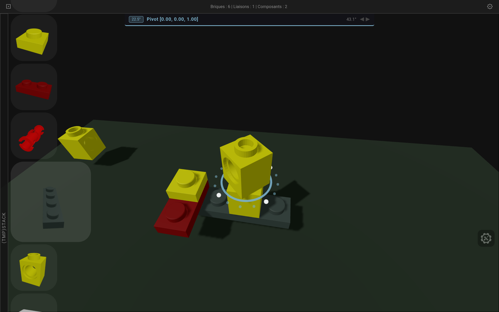

# Briques — early WIP

Outil de création de formes géométriques auxquelles on associe des propriétés mécaniques (slots, liaisons, degrés de liberté), afin de les faire vivre dans une simulation physique interactive.

Tourne entièrement dans le navigateur. Aucune installation requise.
