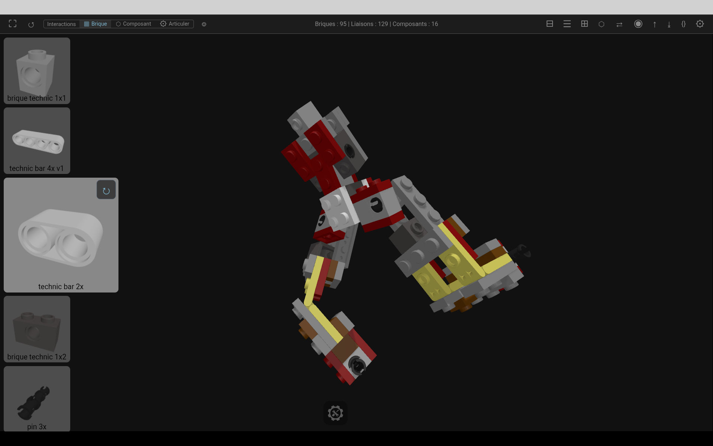
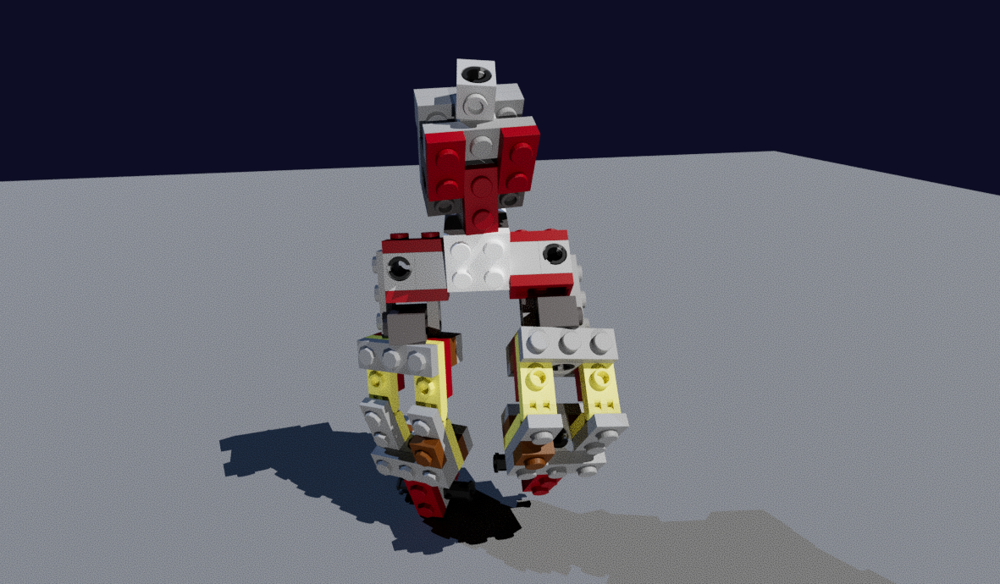
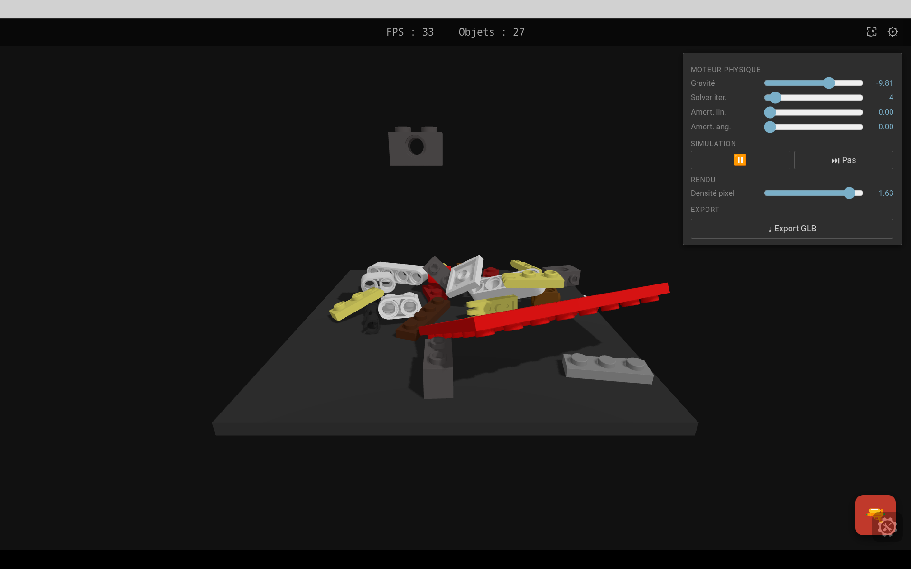

# rBang

**A browser-based 3D brick assembly system with kinematic constraints, CSG modeling, physics simulation and path tracing — built from scratch in vanilla JS.**

**[▶ Live demo](https://s1pierro.github.io/briques/)** · PWA · no install · works on Android

---



---

## What it does

rBang lets you design custom bricks, define their mechanical connection points (slots) and joint types (hinge, slider, ball joint, cylindrical), then assemble them into articulated structures and simulate them.

Five modes:

| Mode | Description |
|------|-------------|
| **Forge** | Design bricks — define geometry (CSG), slot positions, joint types (DOF) |
| **Modeler** | CSG shape editor — boolean operations on primitives (cube, sphere, cylinder…) |
| **Assembler** | Assemble bricks, define connections, manipulate DOF joints with 3D gizmos |
| **Sandbox** | Physics playground — spawn objects, tweak restitution, substeps, CCD, damping |
| **Raytracer** | Path-traced render of the current assembly |

---



---

## Technical highlights

**Kinematic constraint system**
Connections between bricks carry DOF definitions (axis, type, limits). The assembler computes rigid equivalence classes and resolves which parts move when a joint is actuated — including multi-joint chains (open kinematic tree solver with BFS from an anchor class).

**Articulate mode**
Equivalence classes are graph-colored (greedy, minimum colors) so adjacent classes never share a color. All inter-class DOF pickers are shown simultaneously. Picking a joint activates a gizmo that moves the correct sub-tree while keeping the anchor fixed.

**CSG pipeline**
Shape modeling uses [Manifold](https://github.com/elalish/manifold) (WASM), a robust boolean geometry library. Low/medium/high LOD meshes are generated and stored in IndexedDB. The Forge and Modeler share the same CSG pipeline.

**Path tracer**
Powered by [three-gpu-pathtracer](https://github.com/gkjohnson/three-gpu-pathtracer). Renders the assembly with physically-based lighting, progressive accumulation, and denoising.

**Physics**
[Rapier3D](https://rapier.rs/) (WASM). Configurable restitution, friction, linear/angular damping, CCD, substeps — all adjustable at runtime.

**Zero dependencies at runtime**
Pure ES modules, importmap, no bundler, no framework. Three.js, Rapier and Manifold are served as static files.

---



---

## Stack

- **Three.js** — 3D rendering
- **Rapier3D** — rigid body physics (WASM)
- **Manifold** — CSG boolean operations (WASM)
- **three-gpu-pathtracer** — path tracing
- **three-mesh-bvh** — BVH acceleration for raycasting
- Vanilla ES modules — no bundler, no framework

Runs entirely client-side. The Express server only serves static files.

---

## Architecture in brief

```
Launcher
 ├── Sandbox       — physics playground
 ├── Forge         — brick & joint type editor (localStorage)
 ├── Modeler       — CSG shape editor (Manifold WASM)
 └── Assembler
      ├── AsmVerse        — scene graph, connections, Rapier joints
      ├── BrickDock       — full-width touch dock (pick / scroll / slide)
      ├── AsmDofHandler   — DOF gizmos (hinge, slider, ball, cylindrical)
      └── ArticulateTreeSolver — open kinematic tree BFS solver
```

All data persists in localStorage / IndexedDB. Scene and catalogue are importable/exportable as JSON.

---

## Run locally

```bash
npm install
npm run dev   # http://localhost:8081
```

No build step. Edit files in `public/src/`, reload.

---

## Author

**s1pierro** — self-taught, 20 years of practice (C, C++, JS).
Open to freelance missions — 3D web, simulation, WebGL, interactive tools.
Contact: s1p.tom@gmail.com
